# 야누스 사용설명서 (웹·모바일 전 기능)

| 항목 | 내용 |
|---|---|
| 문서 목적 | 실제 화면 순서대로 따라 할 수 있는 역할별 상세 사용 안내 |
| 버전 | v1.0 (2026-07-13 — 기능정의서 v2.1 정합) |
| 대상 | 학생 · 학부모 · 선생님 · 센터관리자/HR/본사 |
| 요약판 | 웹 열람용 Artifact(역할 탭형) 별도 — 본 문서가 상세 원본 |

> **스크린샷 규약** — 이미지 파일은 `docs/screenshots/manual/<파일명>.png`. 캡처 기준: 데모 계정 · 웹 1280px(모바일 화면은 390px) · 개인정보 없는 데모 데이터 상태. 아래 `📷 캡처 가이드`가 붙은 회색 상자가 캡처 대상·상태입니다. 26장 전체가 실캡처로 채워져 있습니다(2026-07-13). 화면 개편 시 같은 가이드로 재캡처하세요.

---

## 0. 접속·계정 공통

### 0.1 접속 주소 (로컬 데모 기준)

| 클라이언트 | 주소 | 대상 |
|---|---|---|
| 웹 | `http://localhost:8080` | 학생 · 선생님 · 관리자(HR·본사 포함) |
| 모바일(웹앱) | `http://localhost:8090` | 학생 · 학부모 (선생님 보조용도 지원) |
| 마케팅 랜딩 | 웹 `/` · `/services` | 비로그인 공개 |

- 외부 접속(터널) 주소는 `docs/접속_주소_정리.md` 참고(퀵 터널은 재기동 시 변경).
- 데모 계정: `student01` `guardian01` `teacher01` `admin01`(센터) `hqadmin`(본사) `hr01` — 공통 비밀번호 `dev-password!`(데모 전용).

### 0.2 로그인·가입·비밀번호

| 하고 싶은 일 | 방법 |
|---|---|
| 로그인 | 아이디·비밀번호 입력. 데모 모드에선 역할 버튼 원터치 채움 |
| 회원가입 | 로그인 화면 → 가입(학생·학부모·선생님). **가입 직후에는 승인 대기** — 센터(HR)가 승인해야 이용 가능 |
| 비밀번호 찾기 | 로그인 화면 → 비밀번호 찾기 → 재설정 링크(토큰) |
| 이메일·휴대폰 인증 | 마이/내 정보 → 연락처 등록 → 인증번호 확인 |
| 로그아웃 | 사이드바/마이의 로그아웃 — 서버에서도 세션이 무효화되므로 다른 기기에서 탈취된 토큰도 함께 차단됩니다 |

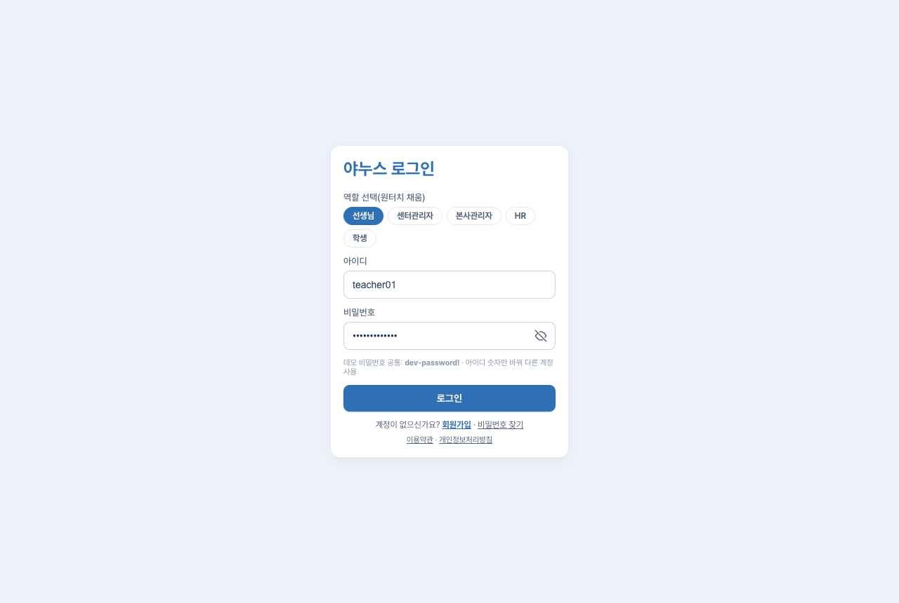
> 📷 캡처 가이드: 비로그인 · `:8080/login` — 데모 역할 원터치 버튼과 '비밀번호 찾기' 링크가 보이게

> 자동 로그아웃: 보안을 위해 세션이 만료되면 다시 로그인해야 합니다. 여러 탭을 써도 세션 갱신은 한 번만 일어나도록 처리돼 있어 갑자기 전 탭이 로그아웃되는 일은 없습니다.

### 0.3 알림 — 받는 법과 끄는 법

- **알림함**: 웹 사이드바 [알림] / 모바일 마이 → 알림. 읽음 처리·전체 목록.
- **실시간**: 접속 중이면 화면 우측 토스트로 즉시 표시. 모바일 앱은 푸시 지원(기기 등록 시).
- **종류별 수신 설정**: 알림 화면(또는 마이 → 알림 설정)에서 카테고리별 on/off — 상담 · 질문(Q&A) · 학사일정 · 공지 · 결제 · 리포트. 끄면 인앱·푸시 모두 오지 않습니다.
- 발송 실패(통신 장애 등)분은 시스템이 주기적으로 자동 재발송합니다.

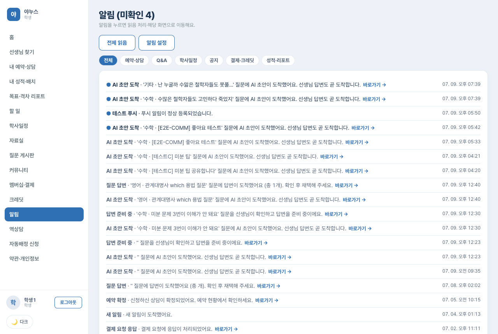
> 📷 캡처 가이드: student01 · 웹 [알림] → 수신 설정 — 카테고리 토글(상담·질문·학사·공지·결제·리포트)이 모두 보이게

### 0.4 약관·개인정보·탈퇴

- [약관·개인정보] 메뉴: 이용약관·개인정보처리방침 열람, 동의 이력. 미성년자는 보호자 동의 정보가 함께 저장됩니다.
- **내 데이터 내보내기**: 내 계정 데이터 사본을 파일로 다운로드.
- **탈퇴**: 같은 메뉴에서 진행. 탈퇴 사유 입력 → 계정 비활성화.

### 0.5 자주 겪는 상황 (전 역할 공통)

| 증상 | 원인·해결 |
|---|---|
| "불러오지 못했어요. 잠시 후 다시 시도해 주세요" | 일시적 연결 문제. 새로고침. (데이터가 없는 것과 구분해 표시됩니다) |
| "새 버전이 배포되었어요 🔄" | 앱 업데이트 직후 이전 화면 캐시. **새로고침 버튼** 한 번이면 됩니다 |
| 화면이 하얗게 멈춤 | 새로고침. 반복되면 브라우저 캐시 삭제 후 재접속 |
| 입장/전송 버튼이 비활성 | 실시간 세션은 **시작 5분 전 ~ 종료 5분 후**에만 열립니다(그 외엔 열람만) |
| 권한이 없다는 안내 | 역할·센터 밖 자원입니다. 메뉴에 안 보이면 원래 권한 밖이에요 |

---

## 1. 학생

웹과 모바일 모두 지원. **모바일 하단 탭**: 홈 · 선생님 · 내 예약 · 강의실 · 자료실 · Q&A · 커뮤니티 · 마이.

### 1.1 홈(대시보드)

- 상단 카드: **오늘 상담 / 다가오는 상담 / 답변 온 질문 / 역상담 제안 / 미확인 알림** 개수.
- "지금 내 위치" 카드: 진단(성적) 유무에 따라 격차 리포트 또는 진단 상담 찾기로 연결.
- 다가오는 학사일정 위젯(D-day 배지), 서비스 바로가기 타일.

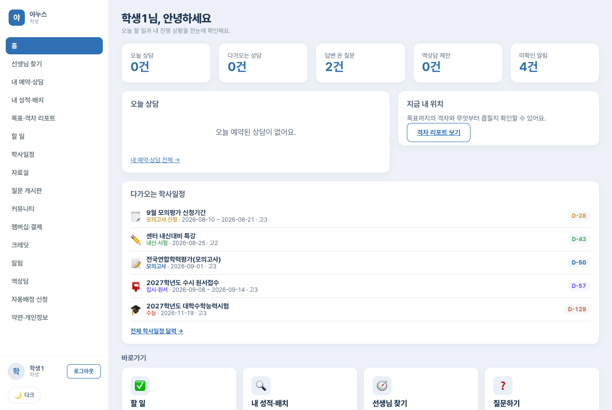
> 📷 캡처 가이드: student01 · 웹 `/student/dashboard` — 상단 통계 카드 5개 + 오늘 상담 + 학사일정 위젯 한 화면

### 1.2 성적 입력·배치 (내 성적·배치)

센터 노출 정책에 따라 메뉴가 보입니다(비활성이면 센터 문의).

**직접 입력**
1. [내 성적·배치] → "성적 직접 입력·스캔" 열기.
2. 기간(예: `2026-1학기 중간`)·시험유형 입력 → 과목·점수 채우기(과목 추가/삭제 가능).
3. 저장 → 추이 차트·격차 리포트에 즉시 반영.

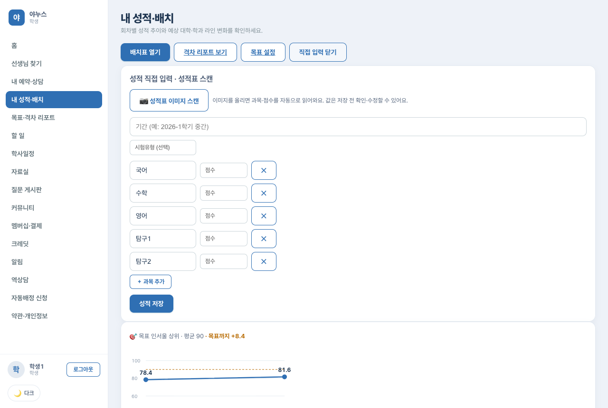
> 📷 캡처 가이드: student01 · `/student/scores` → '성적 직접 입력·스캔' 펼친 상태 — 📷 스캔 버튼과 과목·점수 행이 보이게

**성적표 스캔(OCR)**
1. 📷 버튼으로 성적표 이미지 업로드 → 과목·점수가 자동으로 채워집니다.
2. **저장 전 반드시 값 확인·수정** — OCR은 초안일 뿐입니다.
- 이미지 업로드에는 분당 횟수 제한이 있어요(비용 보호).

**추이·배치**
- 회차별 점수 추이 차트 + (정책 허용 시) 예상 배치 라인.
- **[배치표 열기]**: 로그인 상태 그대로 배치표 서비스로 이동(자동 로그인 연동, 내 성적이 자동 주입). 회원 등급에 따라 노출 범위가 다릅니다.

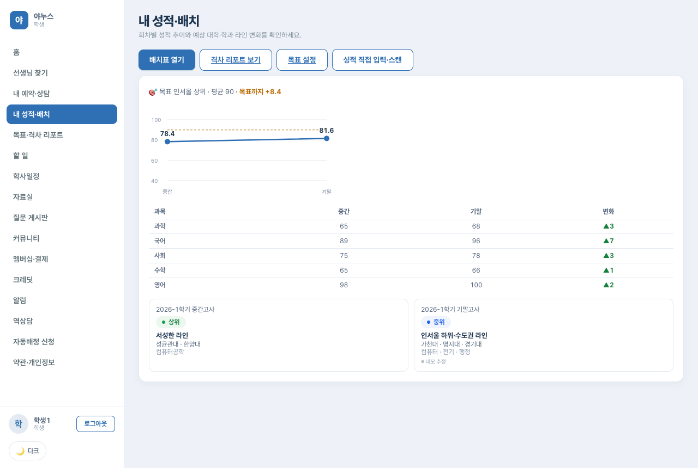
> 📷 캡처 가이드: student01(성적 2회차 이상 입력 상태) · `/student/scores` — 추이 차트와 [배치표 열기] 버튼

### 1.3 목표·격차 리포트

1. [목표·격차 리포트]에서 **목표 설정**: 목표 대학·학과·평균(또는 라인).
2. 격차 리포트가 자동 생성됩니다:
   - **격차 신호등**(안정/주의/위험/심각 4단계) — 목표까지 부족분.
   - **과목별 격차** — 가장 급한 과목이 위로.
   - **근거 배지** — 어떤 데이터로 계산했는지 출처 표시.
   - **처방 카드(CTA)** — "수학 격차 12점 → 수학 전문 선생님 1:1" 같은 다음 행동 버튼.
3. 새 성적이 들어오면 리포트가 갱신되고 이력이 보관됩니다(학부모 리포트와 동일 데이터).

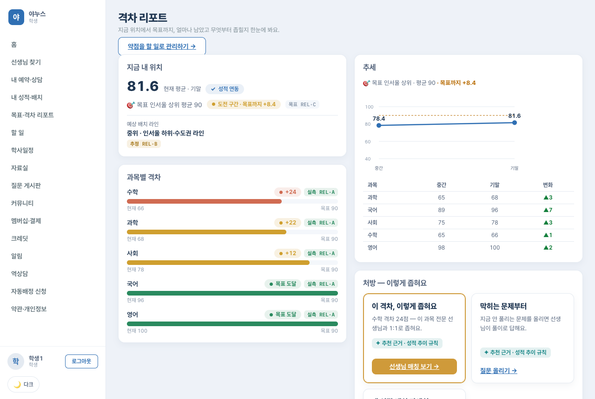
> 📷 캡처 가이드: student01(목표+성적 설정 상태) · `/student/report` — 신호등 밴드·과목별 격차·처방 CTA 카드까지 한 화면

### 1.4 할 일

- 약점 과목(목표 대비 미달)과 30일 내 학사일정에서 **자동 제안**이 만들어집니다(예: "수학 약점 보완 (목표까지 12점)", "6월 모평 대비").
- 직접 추가도 가능. 완료 체크 / 숨기기(제안 다시 안 옴).
- 마감 임박(D-1·당일) 알림이 옵니다.

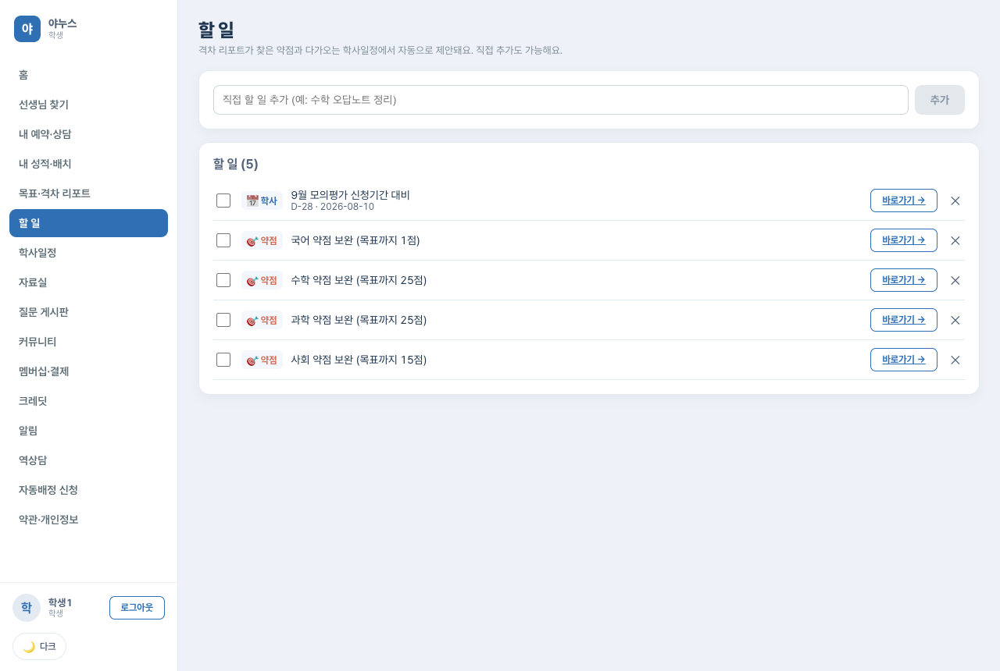
> 📷 캡처 가이드: student01 · `/student/tasks` — 자동 제안(gap:·학사)과 직접 추가 항목이 섞인 목록

### 1.5 선생님 찾기 → 상담 예약

1. [선생님 찾기]에서 **방식 먼저 선택**: 줌 화상 · 채팅 · 필기(화이트보드) · 오프라인.
2. 상담 유형 선택: 담임 · 교과 · 입시 · 심리 (+세부).
3. 필터된 선생님 카드에서 소개·평점·과목 확인 → **견적**(크레딧 소요) 자동 표시.
4. 날짜·시간 슬롯 선택 → 신청. *모든 상담 앞뒤 10분은 자동 휴게 버퍼라 연이어 잡히지 않습니다.*
5. 선생님이 수락하면 **예약됨**으로 확정(크레딧은 신청 시점에 차감, 취소·거절 시 환원).

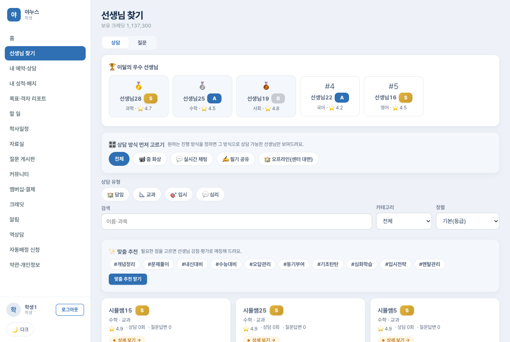
> 📷 캡처 가이드: student01 · `/student/search` — 방식 선택 칩 + 선생님 카드 + 견적 표시

**상태 배지**: `대기`(선생님 수락 전) → `예약됨` → `완료` / `취소` `거절` `노쇼`.

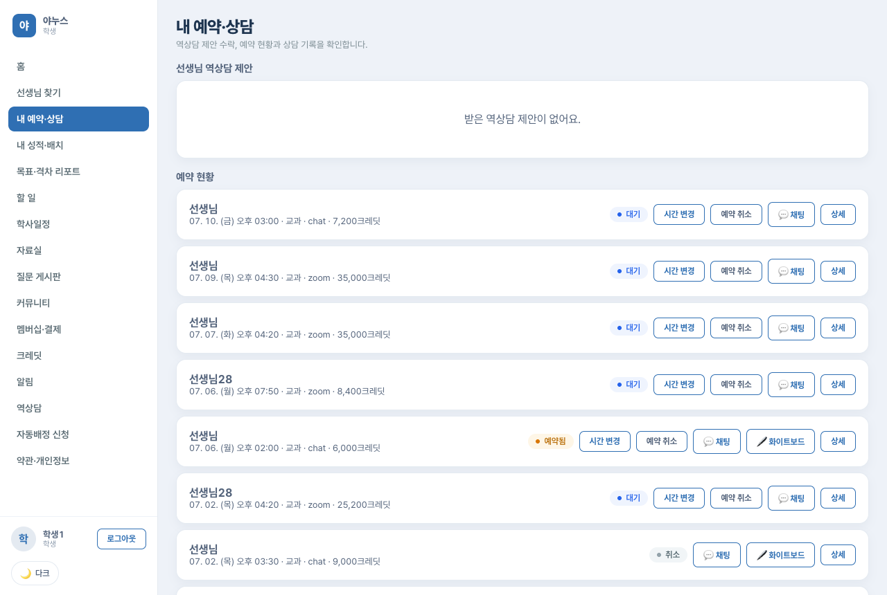
> 📷 캡처 가이드: student01 · `/student/bookings` — 상태 배지가 다른 예약 2건 이상(대기·예약됨)

**변경·취소**
- 시간 변경 요청: 예약 상세에서(상대 동의 필요).
- 취소: 크레딧 자동 환원. **당일취소·노쇼가 반복되면 신규 신청이 제한**될 수 있어요.

**자동배정** (시간 안 정해도 됨)
- [자동배정 신청] → 상담 종류·방식만 고르면 전임 선생님의 빈 시간에 자동으로 배정 → 알림.

**역상담**
- 선생님이 먼저 제안한 상담이 [역상담]에 옵니다. 수락하면 확정(그때 과금)·거절 가능.

### 1.6 상담 세션 (실시간)

- 입장: 예약 카드의 입장 버튼 — **시작 5분 전부터** 활성화.
- **채팅**: 텍스트·이미지, 답장(스레드)·이모지 반응·읽음 표시.
- **화이트보드**: 실시간 공동 필기(펜·형광펜·지우개·레이저 포인터), 이미지/PDF를 배경으로 올려 그 위에 필기, 확대/이동, 자동 저장(다시 열면 이어짐).
- **음성**: 줌 방식이면 회의 링크 입장, 필기 방식이면 내장 음성 통화.
- 세션 종료 후에는 기록 열람만 가능합니다.

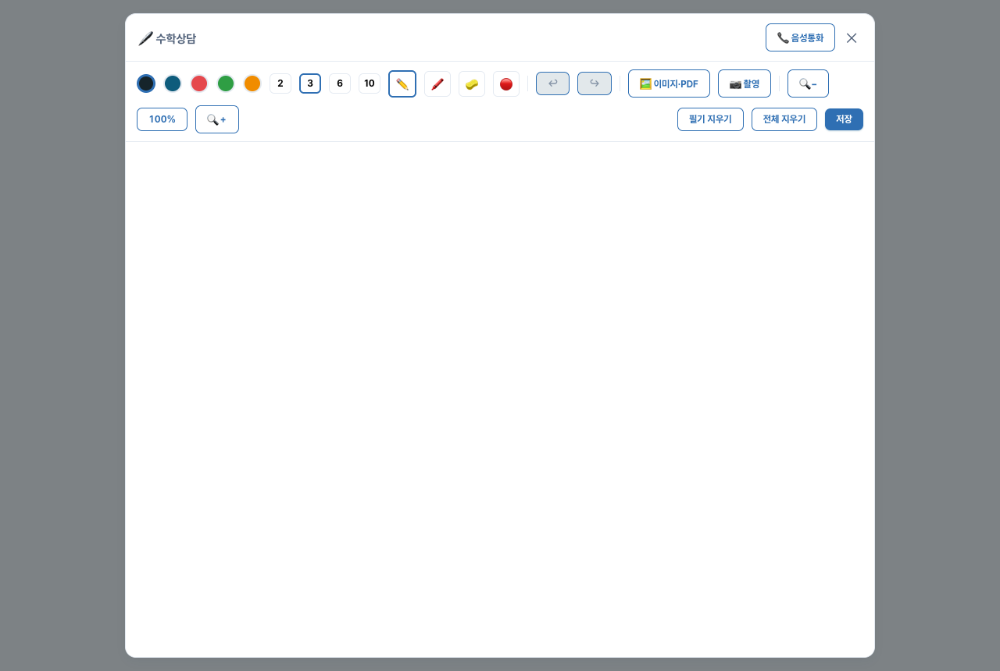
> 📷 캡처 가이드: student01+teacher01 세션 중 — 이미지 배경 위 필기·도구 바가 보이게(더미 문제 이미지 사용)

### 1.7 상담 후기·기록

- 완료 후 **후기 4문항**(태도·내용·실력·재신청 의향) + "이 선생님과 계속할까요?" — 답하면 이후 매칭에 반영(잘 맞는 선생님 우선, 안 맞으면 노출 제외).
- **상담 기록 열람**: 핵심요약 · 숙제 · 향후방향 3가지 공개(선생님 내부 메모는 비공개).

### 1.8 질문 게시판 (Q&A — 유료·빠른 답)

1. [Q&A] → 질문 작성: 과목·본문·이미지 최대 3장. **질문 1건 = 1문항**(여러 문제는 나눠 올리기), 건당 크레딧 차감.
2. 공개 범위 선택:
   - **전체 공개** — 아무 선생님이나 가져가 답변(가장 빠름).
   - **범위 한정 / 1:1 지정** — 특정 그룹·선생님에게만("전체 공개보다 응답이 느릴 수 있습니다" 안내).
3. **진행 단계가 카드에 표시**됩니다: `접수` → `선생님 배정됨`(가져가기) → `답변 완료` → `채택`.
4. 답변이 달리면 알림. 여러 답변 중 **채택**으로 베스트 선택(별점 포함).
5. **재답변 요청**: 답이 부족하면 사유 선택 후 다른 선생님에게 재공개(질문당 횟수 제한, 잔여 횟수 표시).
6. **상담으로 이어가기**: 답변 화면에서 버튼 하나로 그 질문·이미지가 자동 첨부된 상담 예약 화면으로 이동(질문 이미지는 화이트보드 배경으로 자동 로드). 답변 선생님과 계속 or 재매칭 선택.

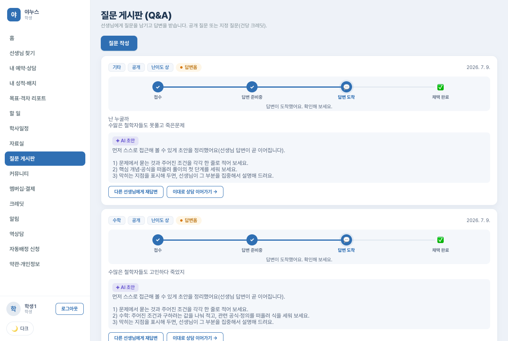
> 📷 캡처 가이드: student01 · `/student/qna` — 질문 작성 폼(이미지 첨부)과 목록의 진행 단계 배지(접수/배정/답변)

> 즐겨찾기(단골): 후기에서 "계속 받고 싶어요"를 누른 선생님은 지정 질문·매칭에서 우선 노출됩니다.

### 1.9 커뮤니티 (무료 3부 게시판)

- 학생 포함 **누구나 질문·답변** 가능한 공개 게시판. 하루 무료 질문 수 제한(기본 3).
- 질문 등록 즉시 **AI 초안 답변**이 달릴 수 있어요 — "AI 생성" 라벨이 붙습니다(사람 답변만 보기 필터 있음).
- 좋아요 · 북마크 · 채택 지원. 부적절한 글은 [신고].

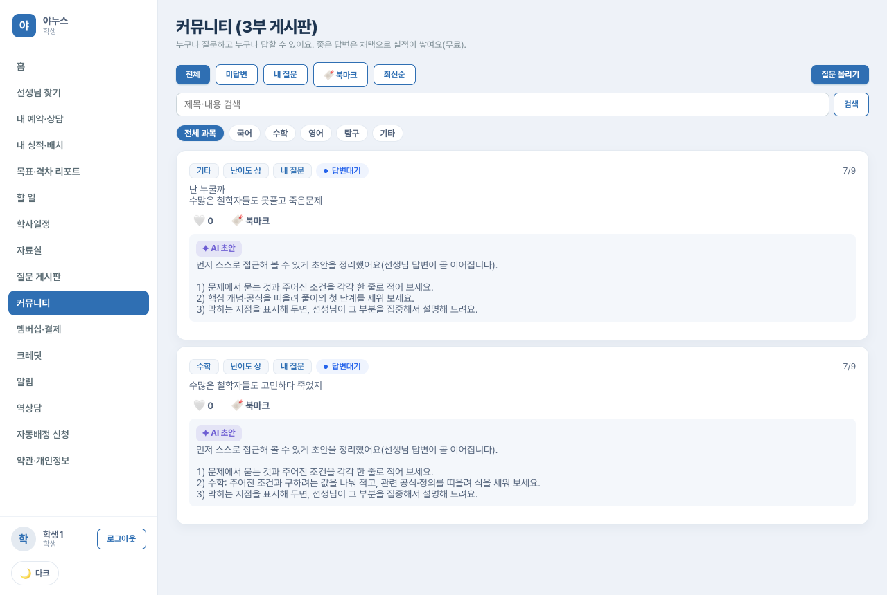
> 📷 캡처 가이드: student01 · `/student/community` — 'AI 생성' 라벨 답변과 좋아요·북마크 버튼이 보이는 글 상세

### 1.10 강의실 (1:다 온라인 강의)

- [강의실] 탭에서 등록된 강의 확인 → 시간에 입장.
- 선생님 판서가 실시간으로 보입니다(학생은 기본 열람).
- ✋ **손들기** → 선생님이 발표권을 주면 내가 판서 가능(회수되면 다시 열람).
- 음성은 자동 수신(선생님만 송출). 녹화된 강의는 목록에서 다시 보기.

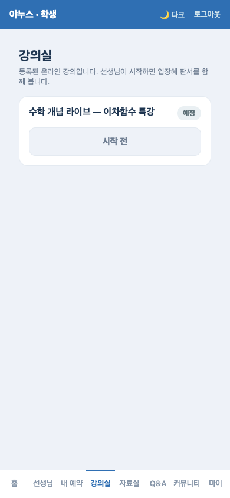
> 📷 캡처 가이드: student01 모바일(390px) · 강의실 탭 — 입장한 강의 화면에서 ✋ 손들기 버튼이 보이게

### 1.11 자료실 · 학사일정

- **자료실**: 선생님이 올린 칼럼·기출 다운로드.
- **학사일정**: 수능·모평·접수 기간 월 달력. 일정 클릭 → 상세. D-day 배지, 임박 일정은 할 일로 자동 제안.

### 1.12 멤버십·크레딧·결제

**크레딧 규칙(중요)**
- 등급 구독 시 **매주 월요일 00:00 자동 부여**, **일요일 밤 소멸**(상위 등급은 월 단위 풀).
- 사용 순서: **만료 임박 부여분 → 구매분**. 잔액 화면에 부여분/구매분·만료 시각 분리 표시.
- 상담 취소·거절 시 사용분 자동 환원.

**메뉴**
- [멤버십·결제]: 등급(Basic/Standard/Premium/VIP) 안내·구독·결제 이력.
- [크레딧]: 잔액·거래 내역·충전. 부족하면 **학부모에게 결제 요청** 가능.

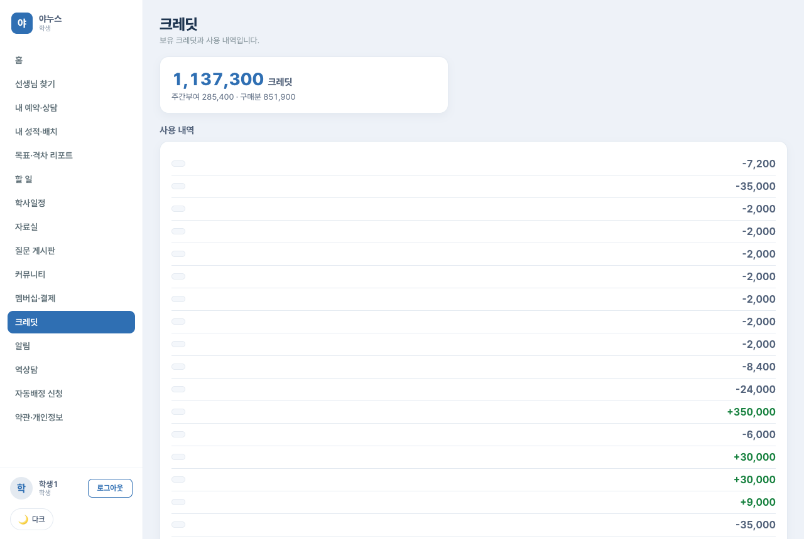
> 📷 캡처 가이드: student01 · `/student/credits` — 부여분/구매분 분리 잔액과 거래 내역

### 1.13 대입 컨설팅 신청

1. `/consulting/apply`(랜딩·홈에서 진입) → 신청서 작성.
2. 자료 업로드: 생기부 등 — **PDF/Word만, 20MB 이하**, 개인정보 동의 필수.
3. 결제(원화 전용) 완료 후 컨설턴트 배정 → 분석·상담 진행 상황이 알림으로 옵니다.
- 업로드 자료는 **결제 완료 후 배정된 컨설턴트만** 열람할 수 있습니다.

---

## 2. 학부모

**모바일(:8090)이 기본**입니다. 하단 탭: 홈 · 상담 · 멤버십 · 결제 · 충전. (웹 로그인 시 공지 페이지로 연결)

### 2.1 자녀 연결

1. 마이/홈에서 **자녀 연결** → 자녀 아이디 입력 → 신청.
2. 자녀(또는 센터) 승인 후 자녀의 상담·리포트·크레딧이 열립니다. 자녀 여러 명 연결 가능(전환 선택).

### 2.2 홈 — 공지·학사일정·다이제스트

- **센터 공지**: 접기/펼치기 목록이라 공지가 많아도 훑기 쉽습니다. 중요 공지는 상단 고정.
- **학사일정**: 수능·모평 등 월 달력 + D-day.
- **주간 다이제스트**: 매주 일요일 아침 자동 발송 — 자녀의 이번 주 성적 변화 · 격차 요약 · 상담 진행 · 할 일 현황을 한 번에.

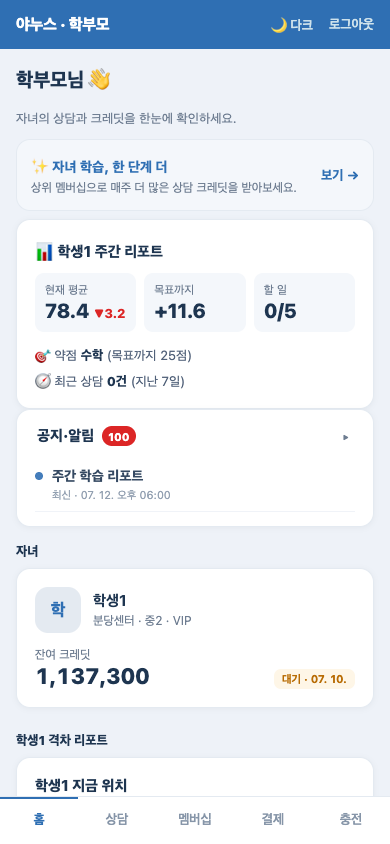
> 📷 캡처 가이드: guardian01 모바일(390px) · 홈 탭 — 접힌 공지 목록 + 학사일정 + 다이제스트 진입점

### 2.3 자녀 리포트·상담 열람

- **격차 리포트**: 자녀의 목표 대비 부족분·약점 과목·처방 방향(학생 화면과 동일 데이터).
- **성적 추이**: 회차별 차트(센터 노출 정책에 따름).
- **상담 탭**: 자녀의 예약 현황과 완료 상담의 **핵심요약·숙제·향후방향** 열람. *선생님 내부 메모는 표시되지 않습니다.*

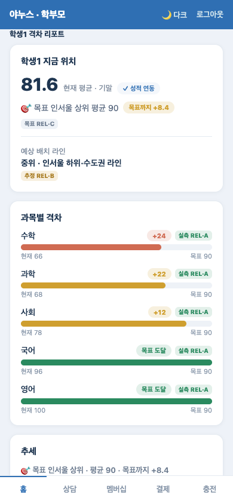
> 📷 캡처 가이드: guardian01 모바일(390px) — 자녀 격차 리포트 화면(신호등·약점 과목)

### 2.4 결제·충전 (대납)

- **충전**: 자녀 크레딧을 학부모 결제수단으로 충전.
- **멤버십**: 자녀 대리 구독(등급 선택 → 매주 크레딧 자동 부여).
- **결제 요청 승인**: 자녀·센터가 보낸 결제 요청(컨설팅 등)을 확인·결제. 이력은 결제 탭.

### 2.5 알림 설정

- 마이 → 알림 설정에서 종류별 on/off. 주간 다이제스트·상담 완료·공지 등만 골라 받을 수 있어요.

---

## 3. 선생님

**웹 콘솔(:8080)이 기본**, 이동 중엔 모바일(하단 탭: 인박스 · 오늘 · 상담 · 기록 · 마이).

### 3.1 첫 설정 — 프로필·근무

1. [내 프로필]: 소개·강점·담당 과목·경력·**제공 방식**(줌/채팅/필기/오프라인) 작성 — 학생 검색 카드에 그대로 노출됩니다.
2. [근무·슬롯]: 주간 근무시간 등록(요일별 시간대). 특정 주만 다르면 주간 플랜으로 덮어쓰기, 휴가·반차 등록.
   - 등록한 시간에만 학생 예약이 열립니다. **앞뒤 10분 휴게 버퍼 자동 적용.**
3. **근무 상태**: 근무 중 · 휴식 · 퇴근 전환 — 휴식/퇴근이면 새 예약이 잡히지 않습니다.

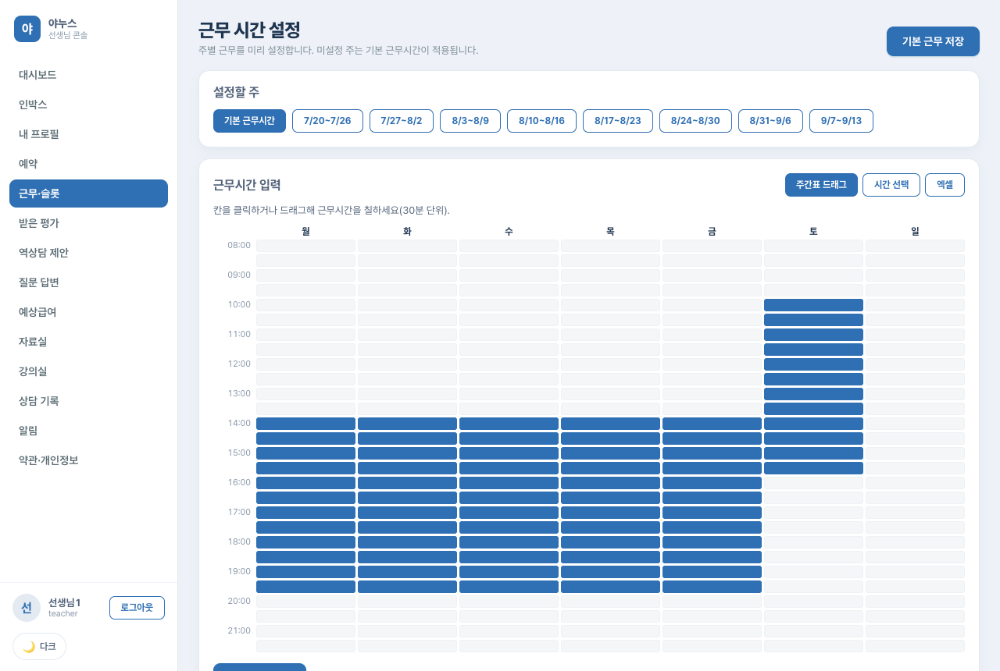
> 📷 캡처 가이드: teacher01 · `/app/schedule` — 주간 근무표 편집 화면(요일별 시간대)과 근무 상태 바

### 3.2 대시보드·인박스

- **대시보드**: 오늘 예약 · 답변 대기 · 받은 평가(등급·항목별) · 예상 급여 · Q&A 성과(누적 답변·채택률·평균 응답시간·이번 주) · 내 성과 순위(본사 노출 정책에 따름).
- **인박스**: 대기 상담신청 + 답변 대기 질문 + 안 읽은 채팅 + 알림을 한 화면에서 — 아침에 여기부터.

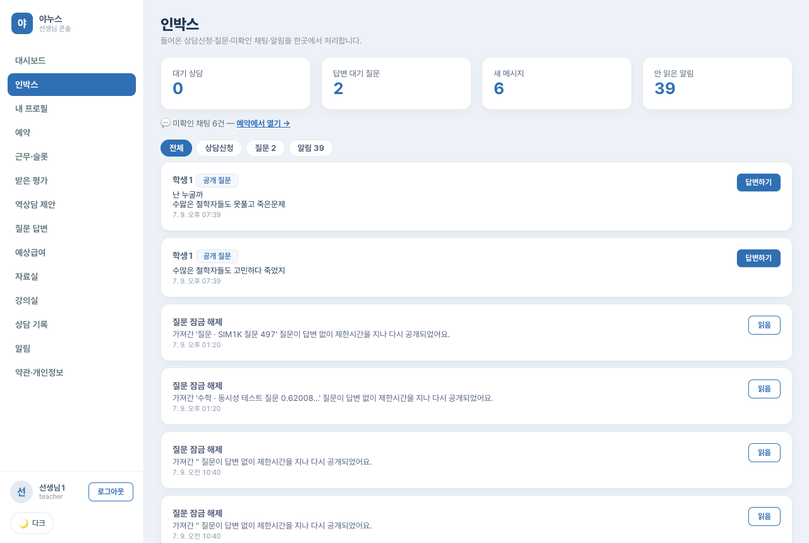
> 📷 캡처 가이드: teacher01 · `/app/inbox` — 대기 신청·질문·미확인 채팅 카운트가 0이 아닌 상태

### 3.3 예약 처리

- 새 신청: 수락(확정) 또는 거절. *과다 거절·당일취소는 랭킹·신규 배정에 불리하게 반영되니 근무시간을 정확히 유지하는 게 유리합니다.*
- 시간 변경: 상대 동의 방식. / 노쇼 처리: 학생 미참석 시(누적 카운트).
- **선생님 사유 취소** 시: 학생에게 대체 선생님 후보가 자동 안내되고 크레딧이 환원됩니다.

### 3.4 상담 진행·기록

1. 시작 5분 전 입장(채팅·화이트보드·음성·줌).
2. 화이트보드: 학생 질문 이미지·PDF를 배경으로 올려 풀이. 필기는 자동 저장.
3. **상담 기록**: 진행 중 **임시저장** 자유, 종료 후 **최종저장(final)까지 해야 완료 처리**.
   - 공개: 핵심요약·숙제·향후방향(학생·학부모 열람) / 비공개: 메모(나만).
4. [상담 기록]·[학생 노트]에서 학생별 이력·성적 추이·기록 개요(담임 공백 등)를 조회 — 첫 상담 준비에 활용.

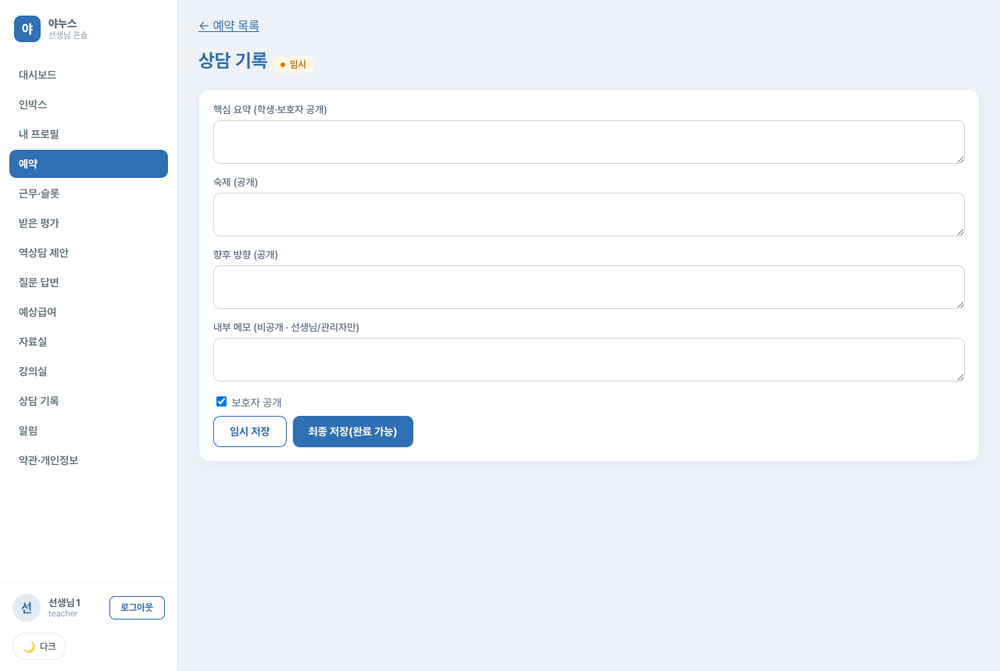
> 📷 캡처 가이드: teacher01 · 완료 예약의 기록 화면 — 핵심요약/숙제/향후방향(공개)과 메모(비공개) 필드 구분이 보이게

### 3.5 Q&A 답변

1. [질문 답변] 큐: 전체 공개 질문 + 나에게 지정된 질문.
2. **가져가기(클레임)** — 선착순으로 내 것이 됩니다(다른 선생님에게 잠김). 접수→첫 응답 시간이 **SLA 지표**로 집계되니 가져간 건 빠르게.
3. 답변 작성(이미지 첨부 가능). **AI 초안**이 이미 달려 있으면 보완·수정하거나 새로 작성 — AI 초안을 거의 그대로 쓰면 자동으로 "AI 참고" 표기가 붙습니다.
4. 학생이 채택하면 채택률·실적에 반영(커뮤니티 무료 게시판 답변은 정산 대상 아님).

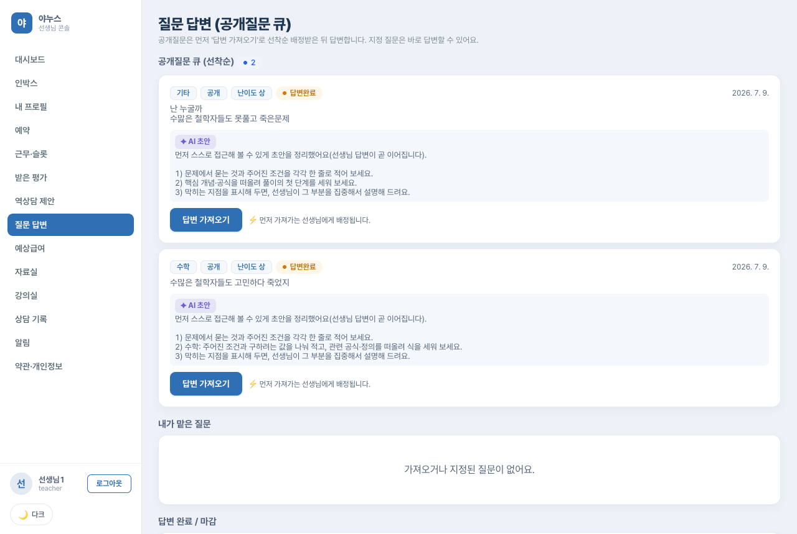
> 📷 캡처 가이드: teacher01 · `/app/qna` — [가져가기] 버튼이 있는 공개 질문과 AI 초안이 달린 질문이 함께 보이게

### 3.6 역상담 제안

- [역상담 제안]: 시스템이 추천한 대상 학생(성적 하락·상담 공백 등)에게 먼저 상담을 제안. 학생 수락 시 확정.

### 3.7 강의실 (1:다)

1. [강의실] → 강의 개설: 제목·일시·정원(기본 100).
2. **학생 초대**: 이름/아이디 검색 → 다중 선택 → 등록.
3. 시작: 판서는 기본 선생님만. 학생 ✋ 손들기 → **발표권 위임/회수**. 출석은 roster에 자동 기록.
4. 음성 송출·**녹화**(시작/종료, 판서/영상) — 녹화물은 목록에서 학생 다시 보기.

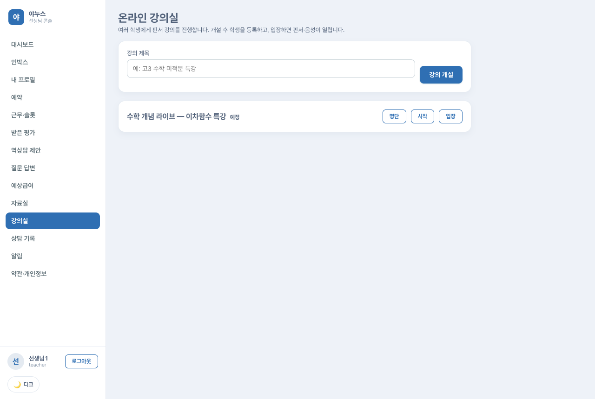
> 📷 캡처 가이드: teacher01 · `/app/classes` — 학생 초대 검색(다중 선택 칩)과 진행 중 강의의 발표권 roster

### 3.8 급여

- [예상급여]: 확정/예상액 실시간 — 완료(확정)·예정 세션의 크레딧 매출 × 0.5원 × 배분율(기본 60%), 4대보험·소득세 공제 후 실지급.
- 명세서: 공제(4대보험·소득세) 반영 실지급액, **PDF 저장/인쇄** 버튼.
- 확정·지급 상태는 관리자 정산 후 갱신됩니다.

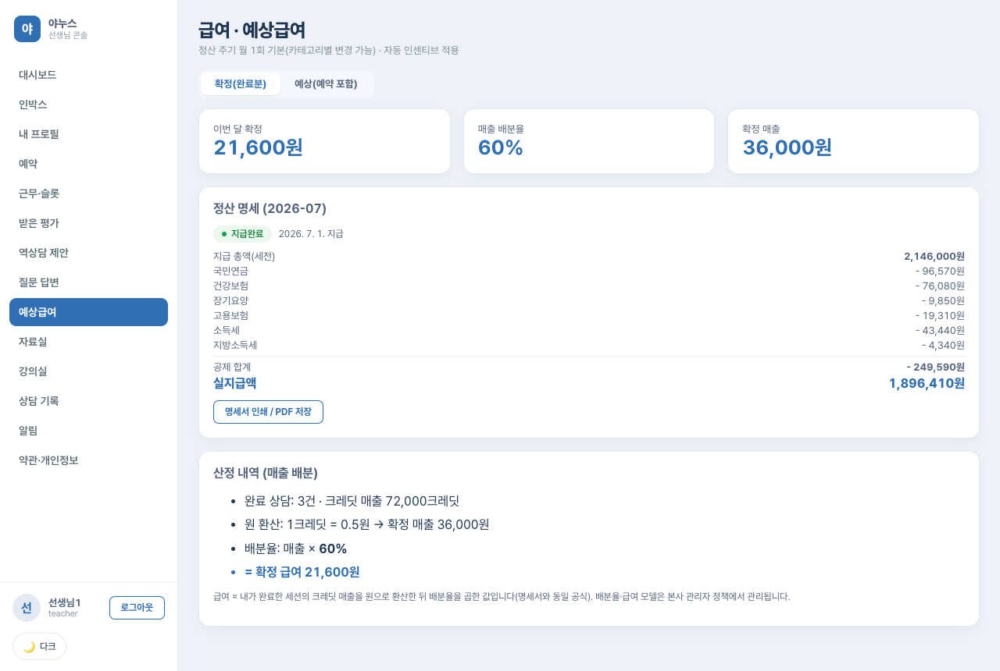
> 📷 캡처 가이드: teacher01 · `/app/payroll` — 산정 내역 카드와 [PDF로 저장/인쇄] 버튼

### 3.9 자료실·받은 평가

- [자료실]: 칼럼·기출 업로드(학생 공개)·관리.
- [받은 평가]: 종합 등급·항목 점수(태도/내용/실력/재신청)·리뷰 수·상위 %.

---

## 4. 관리자 (센터관리자 · HR · 본사)

웹 `/admin`. **센터관리자(L3)** = 자기 센터, **본사(L1·L2, 센터 미소속)** = 전 센터+전사 정책, **HR** = 등록·승인 중심. 메뉴는 권한에 맞게 자동 노출됩니다.

### 4.1 구성원 관리

| 메뉴 | 기능 |
|---|---|
| 학생 등록·관리 | 개별 등록 / **엑셀·CSV 일괄 등록**(템플릿 다운로드 → 업로드, 기존 학생은 갱신) / 자가가입 승인 / 체류시간 등록 |
| 선생님 등록·관리 | 개별·**엑셀 일괄**(과목·등급·직군·고용형태) / 프로필·등급 관리 |
| 직원·권한 | 직원 등록, 권한 레벨(L1~L3) 부여, HR 한도 정책 |
| 회원 분류 | 회원 타입 정의·지정(학생/선생님 분류 체계) |
| 근무 일괄업로드 | 선생님 근무표 엑셀 일괄 등록 |

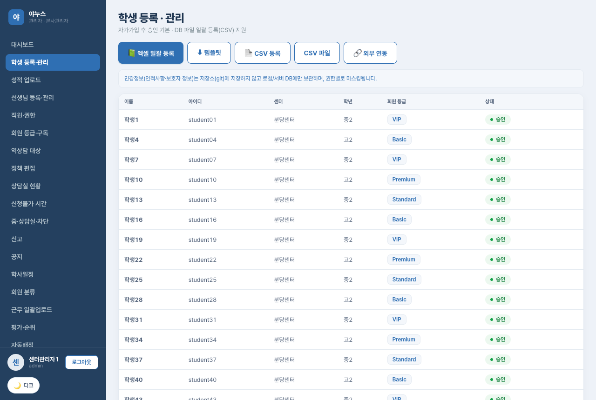
> 📷 캡처 가이드: admin01 · `/admin/students` — 템플릿 다운로드 + 엑셀 업로드 버튼과 결과 메시지

### 4.2 성적 운영

1. [성적 업로드]: 엑셀 일괄(템플릿) 또는 성적표 이미지 **OCR** → 확인 후 저장.
2. 미업로드 학생 필터로 누락 관리, 기간별 목록·CSV 내보내기.
3. **통계 대시보드**: 커버리지·분포·과목 평균·티어 구성·직전 대비.
4. 학생별 예상 배치 라인 입력(또는 자동 추정) — 학생 격차 리포트의 원천.
5. 노출 정책: 학생/학부모/배치 표시 여부를 [정책 편집]에서.

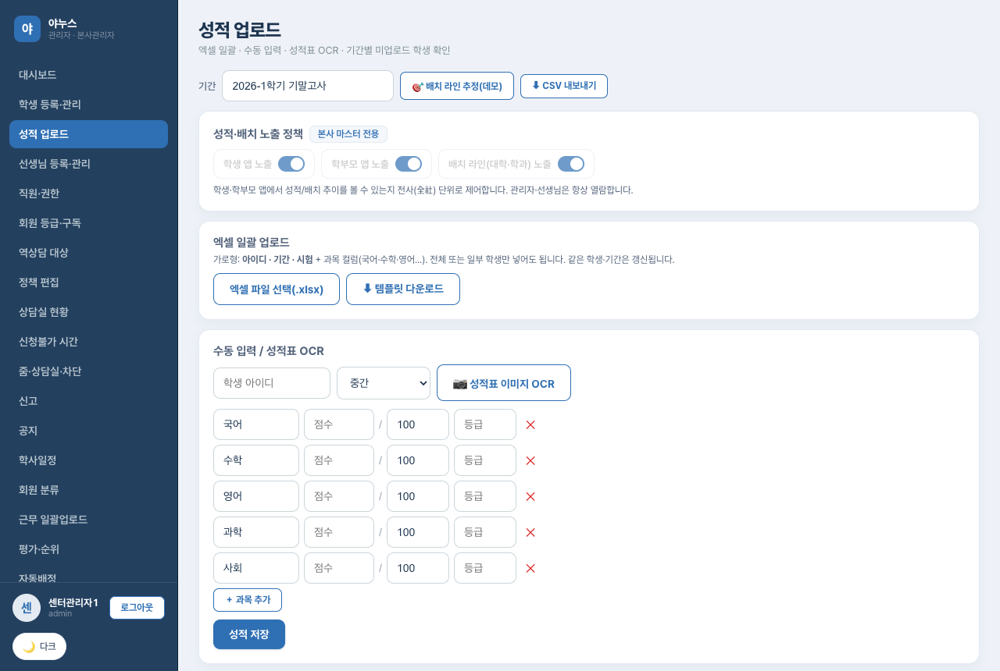
> 📷 캡처 가이드: admin01 · `/admin/scores` — 업로드 영역과 통계 대시보드(커버리지·분포)

### 4.3 정책·요금 (센터 운영의 심장)

- **요금**: 상담 시간당 단가(방식별), S급 할증, 게시판(질문) 건당가, 오프라인 점유료.
- **한도**: 학생 예약 수, 담임 상담 주기, 취소·노쇼 임계(초과 시 신청 제한).
- **기능 노출**: 상담 방식·유형별 on/off(전사 정책이 센터 정책에 우선).
- **Q&A 정책**: 무료 일 상한, AI 초안 on/off·일 상한, 재답변 한도.

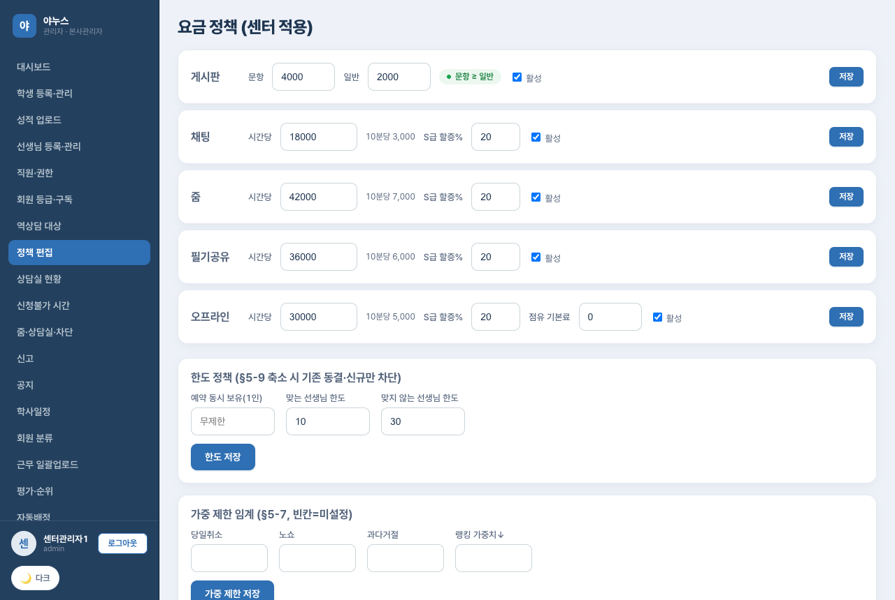
> 📷 캡처 가이드: admin01 · `/admin/policy` — 요금·한도·기능 노출 편집 화면

### 4.4 일상 운영

| 메뉴 | 기능 |
|---|---|
| 공지 | 역할별 타겟 발송, **예약 발송**, 템플릿 |
| 학사일정 | 등록·수정(본사=전국 공통, 센터=우리 센터 노출), 유형·학년 배지 |
| 신고 | 접수 목록 → AI 1차 검토 요약 참고 → 처리(경고·차단), 처리 이력 |
| 상담실 현황 / 신청불가 시간 / 줌·상담실·차단 | 오프라인 상담실 배정, 센터 차단 시간대, 줌 동시 한도 |
| 자동배정 | 신청 현황·충원 실행 결과 모니터링 |
| 역상담 대상 | 제안 대상 학생 리스트(성적 하락·공백 기준) 관리 |

### 4.5 평가·정산

1. [평가·순위]: 가중 평가엔진 — 지표 가중치 조정 → 선생님 랭킹(역지표 자동 반전).
2. 월간 시수: **엑셀 업로드**(템플릿) → 근무자별 단가 반영.
3. [급여 정산]: 예상액 검토 → 확정 → 정산 리포트. 매출 분배 모델(share) 관리(본사).
4. [센터 분석]: 참여도·전환 지표, 센터 비교(본사·z-score), 5개 피벗 뷰.

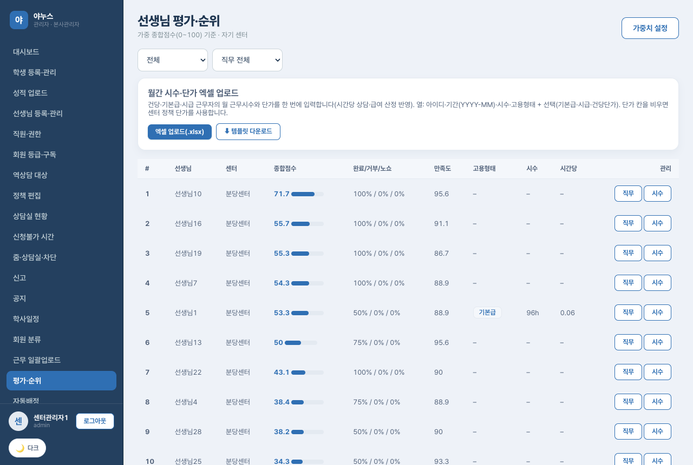
> 📷 캡처 가이드: admin01 · `/admin/evaluation` — 가중치 조정 UI와 선생님 랭킹 표

### 4.6 본사 전용

| 메뉴 | 기능 |
|---|---|
| 조직 관리 | 센터 생성·관리 |
| 연계 서비스(SSO) | 배치표·입결 등 외부 도구 등록, 진입 토큰 정책(등급 게이트), **유출 시 epoch 회전으로 전체 무효화** |
| 카테고리 관리 | 상담 유형·세부 체계 |
| 대시보드 노출 정책 | 선생님 성과 대시보드 표시 여부·탭·센터별 제어 |
| 감사 로그 | 정책 변경·민감 조회 기록(누가·언제·무엇을) 열람 |

### 4.7 관리자 FAQ

- **엑셀 업로드가 실패해요** → 반드시 화면의 템플릿을 받아서 그 양식 그대로. 필수 열 누락·형식 오류 행은 결과 메시지에 표시됩니다.
- **선생님이 예약을 못 받아요** → ①근무·슬롯 미등록 ②근무 상태가 휴식/퇴근 ③해당 방식이 정책에서 꺼짐 순서로 확인.
- **학생 화면에 성적 탭이 안 보여요** → 정책 편집에서 성적 노출이 꺼져 있는지 확인.

---

## 5. 서비스 규칙 요약 (전 역할 공통 — 알아두면 좋은 것)

| 규칙 | 내용 |
|---|---|
| 휴게 버퍼 | 모든 상담 앞뒤 10분 자동 확보 — 슬롯이 붙어 보여도 예약은 겹치지 않음 |
| 세션 시간창 | 실시간 참여는 시작 −5분 ~ 종료 +5분. 그 외 열람 전용 |
| 크레딧 | 월요일 부여 → 일요일 소멸(등급별) · 만료 임박분부터 소비 · 취소 시 환원 |
| 기록 공개 | 핵심요약·숙제·향후방향 = 학생·학부모 공개 / 메모 = 선생님 내부 |
| 취소·환원 | 선생님 사유 취소 = 대체 후보 안내 + 전액 환원 / 학생 반복 당일취소·노쇼 = 신청 제한 |
| 강의 판서 | 서버가 역할을 검증 — 발표권 없는 참가자의 판서는 등급과 무관하게 차단 |
| Q&A 1문항 | 질문 1건 = 1문항. 여러 문제는 나눠 올려야 각각 빠른 답을 받음 |
| AI 표기 | AI가 만든 초안·답변에는 항상 라벨 표시(미표기 유사 답변도 자동 감지·표기) |
| 개인정보 | 생기부 등 민감 자료는 결제·배정된 담당자만 열람, 모든 민감 조회는 감사 기록 |

---

## 6. 문서 이력

| 버전 | 일자 | 변경 |
|---|---|---|
| v1.0 | 2026-07-13 | 최초 작성 — 기능정의서 v2.1 전 도메인 기준, 역할 4종 × 메뉴 전수 |
| v1.1 | 2026-07-13 | 스크린샷 자리 25곳 삽입(파일 경로·캡처 가이드 규약 포함, `docs/screenshots/manual/`) |
| v1.2 | 2026-07-13 | 스크린샷 26장 실캡처 채움(헤드리스 Chrome·데모 계정, 웹 1280/모바일 390) |
